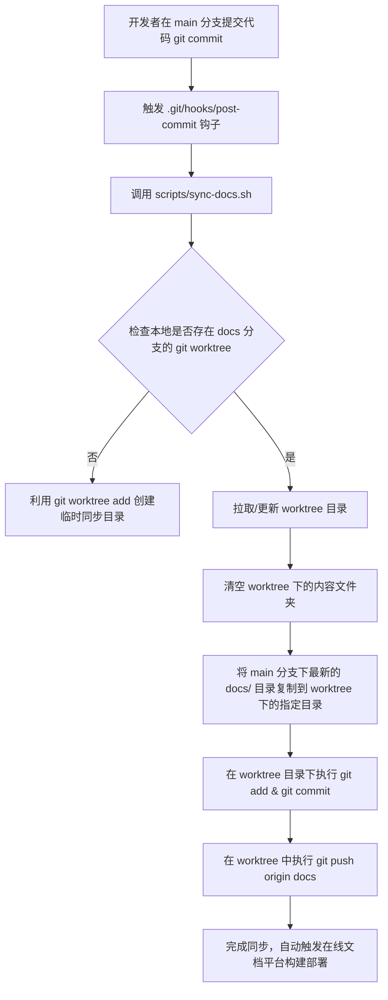

# 文档分支自动同步设计 (Docs Sync Design)

## 概述 (Overview)
为了保证项目的开发源码与技术文档的一致性，同时又不污染主要的代码开发分支（`main`），我们需要将文档的展示站点（VuePress + theme-plume）部署在独立的文档分支（`docs`）。
当开发者在主开发分支（如 `main`）下修改并提交 C# 源码或 `/docs` 中的技术文档时，系统通过自动化钩子与脚本，在不切换开发者当前工作分支的前提下，将 `/docs` 目录下的 Markdown 文件转换为符合 VuePress 目录结构的文件并同步至独立的 `docs` 分支。这样便能完美实现代码和文档的协同更新，达到在线实时访问最新文档的功能。

---

## 架构设计 (Architecture)

### 1. 物理分支隔离
- **`main` 分支**：存放 C# 核心开发代码和最原始的 `/docs` 文档目录。所有文档遵循 `/docs/数字前缀.目录/文件名.md` 的规范编写。
- **`docs` 分支**：纯净的静态文档项目分支。其根目录下包含 `package.json`、`pnpm-workspace.yaml` 及 `.vuepress/` 配置目录。所有的 Markdown 文档存放在该分支下的内容展示目录（如 `docs/` 或 `src/`）中。

### 2. 同步与构建引擎
- **本地同步层**：利用 `git worktree`。`git worktree` 允许在物理磁盘上的另一个目录同时检出 `docs` 分支，从而在本地 `post-commit` 钩子中，可以直接向该 worktree 目录复制文件、创建提交并推送，**完全无需切换开发者当前在主项目中的工作分支**，保障无痛开发体验。
- **CI/CD 触发层**：编写 GitHub Actions Workflow，当 `main` 分支有代码推送时，自动抓取文档，合并到 `docs` 分支，保障远程云端自动同步和构建发布。

---

## 数据流设计 (Data Flow)

### 1. 本地提交同步流 (Git post-commit Hook)

---

## 接口与交互说明 (Interfaces)

### 1. 同步脚本签名 (`scripts/sync-docs.sh`)
- **调用方式**：`bash scripts/sync-docs.sh [--push]`
- **参数说明**：
  - `--push`：指定在同步完成后是否自动执行 `git push` 推送至远程仓库。默认在本地 post-commit 钩子中开启。
- **功能职责**：
  1. 验证当前分支与环境。
  2. 初始化/定位 `.git-docs-worktree` 临时同步工作区。
  3. 执行增量清理与覆盖复制。
  4. 生成自动同步提交（Commit Message 包含原 `main` 分支的 Commit 哈希与提交信息，以保持追溯性）。

### 2. Git post-commit Hook
- **路径**：`.git/hooks/post-commit`
- **触发时机**：每次在本地执行 `git commit` 成功后自动执行。
- **操作**：调用 `bash scripts/sync-docs.sh --push`。

---

## 技术风险与边界 (Risks & Boundaries)

### 1. 本地工作区锁定与冲突
- **风险**：如果在复制文件时，两个分支正在同时被其他进程修改，可能会发生写冲突。
- **规避**：使用独立的 `.git-docs-worktree` 临时工作区，并且在同步脚本中每次在同步前运行 `git reset --hard` 以清理工作树，保障幂等性与绝对干净。

### 2. 构建依赖与环境
- **风险**：VuePress 在 Node.js 20+ 环境下构建，由于用户操作系统各异，本地可能未安装 Node.js，导致无法本地预览。
- **规避**：在 `docs` 分支的 README 中给出明确的 Node.js/pnpm 安装指引，并在 GitHub Actions 中配置完备的 Node 环境自动构建。

### 3. Git History 膨胀
- **风险**：频繁的 post-commit 同步会导致 `docs` 分支产生海量同步 commit。
- **规避**：这在文档发布分支中属于正常现象（类似 GitHub Pages 部署分支）。同步 commit 会详细记录源 commit 哈希，以便追踪。

---

> [!TIP]
> 本项目的文档同步机制已在本地 Git 钩子及 GitHub Actions 云端流水线中全面集成，确保开发与文档时刻保持完美统一。

