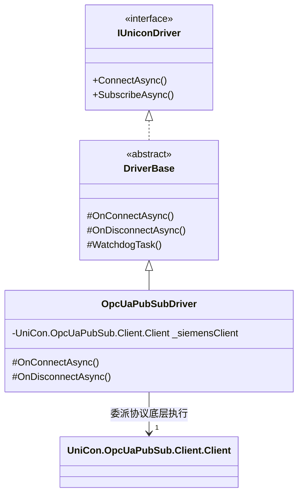

# OPC UA PubSub 驱动集成与架构设计分析 (OPC UA PubSub Integration & Architecture Analysis)

## 概述 (Overview)
随着西门子官方的 `opc-ua-pubsub-dotnet` 开源库（Binary/Client/Broker）集成到 UniCon 工程中，系统内部出现了两个包含 OPC UA PubSub 通讯与解析逻辑的项目：
1. **`UniCon.Drivers.OpcUaPubSub`** (自研驱动层，提供 `IUniconDriver` 适配)
2. **`UniCon.OpcUaPubSub.Client`** (西门子通讯 SDK 层，提供协议细节实现)

本篇文档旨在从架构设计角度，深度剖析这两个组件在职责、依赖、运行机制上的重叠性，并评估如何优雅地将它们进行统一合并，以求实现极佳的生产级工程结构。

---

## 核心职责与重叠点分析 (Responsibility & Overlap Analysis)

为了明确二者是否能够合并，首先需要理清它们各自的核心职能与定位：

```mermaid
graph TD
    subgraph UniCon Core Ecosystem
        Core["UniCon.Core (IUniconDriver, DriverBase, Watchdog)"] --> Driver["UniCon.Drivers.OpcUaPubSub"]
    end
    
    subgraph Siemens PubSub Core (SDK)
        Driver --> ClientSDK["UniCon.OpcUaPubSub.Client"]
        ClientSDK --> BinarySDK["UniCon.OpcUaPubSub.Binary"]
    end
```

### 1. 职责对比矩阵

| 特性 / 职责 | `UniCon.Drivers.OpcUaPubSub` | `UniCon.OpcUaPubSub.Client` |
| :--- | :--- | :--- |
| **层级定位 (Layer)** | **Domain / Application 驱动适配层** | **Infrastructure 协议协议底座层** |
| **对外接口 (Interface)** | 统一实现 `IUniconDriver` 接口 | 自定义 API (`TestClient`, `Client` 等) |
| **核心职责 (Responsibility)** | 挂载 UniCon 自愈看门狗 (Watchdog)、指数退避重连算法、统一的统一状态输出。 | OPC UA PubSub 规范标准协议实现（数据块分包分片 Chunking、安全证书 TLS、证书缓存机制、模拟器）。 |
| **核心依赖 (Dependencies)** | `UniCon.Core` (高度耦合) | 纯净第三方库 (`MQTTnet` 等，完全不依赖 `UniCon.Core`) |
| **通讯栈支持 (Transports)** | UDP (多播) 与 MQTT | MQTT 传输为主 (带 TLS 与模拟控制) |

### 2. 重叠领域分析

*   **传输层重叠**：`UniCon.Drivers.OpcUaPubSub` 中自行编写了 `MqttPubSubTransport.cs`，而西门子的 `Client.cs` 内部同样基于 `MQTTnet` 封装了 Mqtt 客户端连接与订阅逻辑。
*   **模拟与配置重叠**：西门子库内置了 `Settings` 和 `Simulation` 逻辑，用于快速生成本地 PubSub 模拟流；而 UniCon 拥有自身完善的配置体系与驱动注册中心。

---

## 统一合并方案评估 (Integration Strategies)

对于重叠的部分，我们主要有两种可行的架构重构选择：

### 方案 A：直接合二为一（将驱动逻辑彻底合并进 `Client` 中）
**做法**：将 `UniCon.Drivers.OpcUaPubSub` 物理删除，并让 `UniCon.OpcUaPubSub.Client` 直接引用 `UniCon.Core`，并使 `Client.cs` 直接继承 `DriverBase` 并实现 `IUniconDriver`。

*   **❌ 缺点（严重违背 Clean Architecture 精神）**：
    1.  **污染基础协议 SDK**：西门子 `Client` 项目定位为纯净的 OPC UA 协议层，如果不加节制地让其强行依赖 `UniCon.Core`，它将彻底失去独立作为 SDK 被其他项目二次复用的能力。
    2.  **违反单一职责原则 (SRP)**：西门子库需要承载繁重的证书管理、分包重组（Chunking）、数据帧打包逻辑。如果还要承担自愈监控看门狗、指数退避策略等 UniCon 框架特有逻辑，将导致该项目异常臃肿。
    3.  **升级与维护地狱**：一旦未来西门子官方 GitHub 仓库发布了关键 Bug 修复或协议更新（如支持 OPC UA PubSub 1.05 新特性），合并后的项目将由于内部高度定制化，无法平滑同步上游代码。

### 方案 B：保持物理分离，实施「适配器模式」(Adapter Pattern) 进行统一集成（🏆 强烈推荐）
**做法**：
*   **西门子项目定位**：`UniCon.OpcUaPubSub.Client` 和 `Binary` 作为**纯粹的基础设施依赖 (Infrastructure Dependency)**，不依赖任何 UniCon Core 命名空间。
*   **驱动项目定位**：`UniCon.Drivers.OpcUaPubSub` 作为标准的**适配器 (Adapter)**。
*   **重构方案**：将驱动层内手写的 `MqttPubSubTransport.cs` 移除，代之以直接实例化并调用 `UniCon.OpcUaPubSub.Client.Client`，让驱动只负责生命周期 and 自愈看门狗调度。



*   **🏆 优势**：
    1.  **完美的依赖隔离**：完全符合 **Domain → Application → Infrastructure** 依赖倒置原则。
    2.  **架构极致清晰**：
        *   西门子库负责：*怎么收发 OPC UA 消息*。
        *   驱动层负责：*UniCon 框架怎么管理这个驱动的连接与自愈*。
    3.  **顺滑同步上游**：由于西门子底层代码没有被 UniCon 框架代码侵入，未来如果西门子库升级，可以直接进行源码级的替换而不需要二次修改。
    4.  **一致的开发体验**：该设计与项目里 `UniCon.Drivers.S7`（完全包装第三方 `S7.Net` SDK）的架构理念完全一致，具有极佳的对称美感。

---

## 下一步重构行动建议 (Recommended Action Plan)

为了实现方案 B 的优雅适配，我们应该在接下来的演进中采取以下步骤：

1.  **保留三方包纯净度**：不再对 `UniCon.opc.ua.pubsub.Binary/Client` 的内部逻辑做任何 UniCon 相关的耦合修改，维持其通用的协议 SDK 定位。
2.  **重构驱动传输委派**：在 `UniCon.Drivers.OpcUaPubSub` 中，重新定义 `IPubSubTransport` 的实现：
    *   对于 MQTT，底层的 `MqttPubSubTransport` 可以逐步重构为直接包装 `UniCon.OpcUaPubSub.Client.Client` 的类，由其统一管理证书、 settings 配置与 MQTT 订阅流。
    *   通过此种包装，我们极大地简化了自研驱动底层的网络交互代码，转而享受成熟、高并发的工业级 Client 实现。
