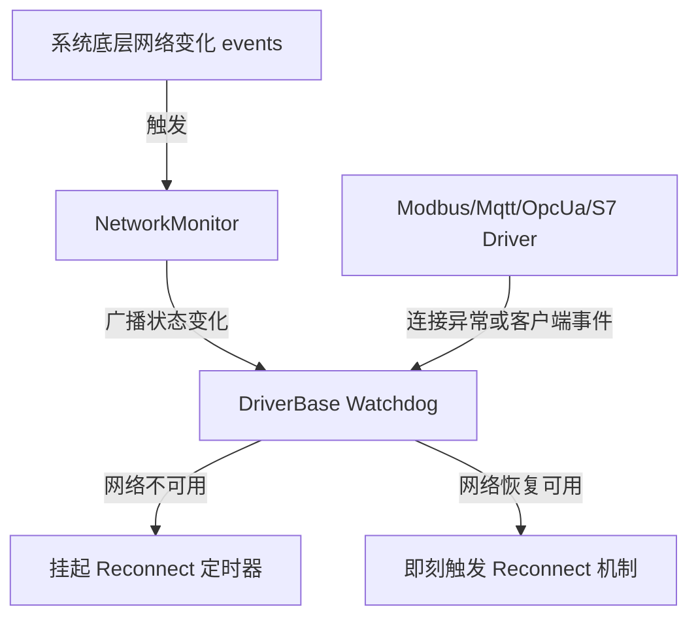

# 驱动连接自愈与网络韧性设计文档

## 概述 (Overview)
随着 UniCon 在工业网关场景的应用，物理网络不稳定（如无线漫游/WIFI切换、以太网卡断开、IP变动等）以及各协议客户端自身通道中断，会直接影响网关与工业设备连接的健壮性。
本文档阐述如何设计高可靠、超灵敏的底层连接感知事件体系与物理网络状态监控引擎，使系统能够自适应网络故障并在毫秒级完成连接自愈。

---

## 架构设计 (Architecture)



### 1. 网络监控层 (Infra)
- **INetworkMonitor**: 抽象的系统网络状态检测接口。
- **NetworkMonitor**: 基于 .NET Standard 的 `System.Net.NetworkInformation.NetworkChange` 事件，动态监控系统的网卡活动及网络可用性状态。

### 2. 驱动协调层 (Core)
- **DriverBase**: 
  - 构造函数注入 `INetworkMonitor`。
  - 重构 `WatchdogLoopAsync`：
    - 在进入 `ReconnectAsync` 之前，判断 `_networkMonitor.IsNetworkAvailable` 是否为 `false`。如果是，则暂时挂起（暂停重连操作，减少无效的套接字连接日志与 CPU 消耗），直到 `NetworkAvailabilityChanged` 触发且为 `true` 时，唤醒 Watchdog 快速触发重连。
    - 允许派生驱动通过监听底层套接字/客户端的连接失效事件（如 `Faulted`, `Closed`, `Disconnected` 等），直接更新 `State = DriverState.Faulted`。这将在 Watchdog 下一次循环（或触发信号）时即刻激活自愈流程，实现毫秒级反应。

### 3. 通讯协议驱动层 (Drivers)
- **MqttDriver**: 挂载 `IMqttClient.DisconnectedAsync` 事件。
- **OpcUaDriver**: 挂载 `ClientSessionChannel.Faulted` 与 `Closed` 事件。
- **ModbusDriver**: 在 `InternalReadAsync` / `InternalWriteAsync` 中捕获 Socket 错误或通信异常，直接转换 `State = DriverState.Faulted`；并在 `PingAsync` 中检验底层 Socket 连通性。
- **S7Driver**: 在 `InternalReadAsync` / `InternalWriteAsync` / `ReadBatchAsync` / `WriteBatchAsync` 中捕获 `PlcException` / `SocketException`，即刻修改驱动状态为 `Faulted`。
- **OpcUaPubSubDriver**: 在 `IPubSubTransport` 扩展 `ConnectionLost` 事件，并在 `MqttPubSubTransport` 异常断开时抛出，由驱动捕获并转换 `State = DriverState.Faulted`。

---

## 接口说明 (Interfaces)

### 1. INetworkMonitor 接口
```csharp
namespace UniCon.Core.Network;

public interface INetworkMonitor
{
    /// <summary>
    /// 获取当前系统网络是否可用
    /// </summary>
    bool IsNetworkAvailable { get; }

    /// <summary>
    /// 当系统网络可用性发生改变时触发
    /// </summary>
    event EventHandler<bool>? NetworkAvailabilityChanged;
}
```

### 2. IPubSubTransport 扩展
```csharp
namespace UniCon.Drivers.OpcUaPubSub.Transports;

public interface IPubSubTransport : IAsyncDisposable
{
    event EventHandler<byte[]>? OnMessageReceived;
    
    /// <summary>
    /// 当传输物理连接丢失时触发
    /// </summary>
    event EventHandler? ConnectionLost;

    Task ConnectAsync(Uri uri, CancellationToken ct = default);
    Task DisconnectAsync(CancellationToken ct = default);
}
```

---

## 数据流设计 (Data Flow)

### 1. 物理断网自愈流程
```
[操作系统断网/切WIFI] 
      │
      ▼
[NetworkChange.NetworkAvailabilityChanged] 触发
      │
      ▼
[NetworkMonitor.IsNetworkAvailable] 设为 false
      │
      ▼
[NetworkMonitor.NetworkAvailabilityChanged] 广播 false
      │
      ▼
[DriverBase Watchdog] 挂起重连定时器，拒绝无效 TCP 请求
      │
[系统网络恢复]
      │
      ▼
[NetworkMonitor.NetworkAvailabilityChanged] 广播 true
      │
      ▼
[DriverBase Watchdog] 立即唤醒 ReconnectAsync 流程
      │
      ▼
[OnConnectAsync] 执行，设备恢复连通
```

### 2. 协议客户端断线事件流程
```
[设备断电/通道中断]
      │
      ▼
[底层 Client (如 MqttClient / OPC UA ClientChannel) 事件触发]
      │
      ▼
[Driver 监听到 Disconnected / Faulted]
      │
      ▼
[State = DriverState.Faulted] (改变状态)
      │
      ▼
[WatchdogLoop] 下一次循环立即触发 [ReconnectAsync]
```

---

## 边界与技术债 (Risks & Boundaries)

1. **多网卡环境下的“可用性”判断限制**：
   `NetworkInterface.GetIsNetworkAvailable()` 在具有虚拟网卡（如 Docker, VPN, VMware 等）的系统中，可能总是返回 `true`。因此我们在 `NetworkMonitor` 中同时监测 `NetworkChange.NetworkAddressChanged`，并在断线或连接中捕获套接字异常以作为终极兜底。
2. **连接风暴**：
   在断网恢复的瞬间，如果系统中存在成百上千个驱动，可能会因同时发起重连而引发“连接风暴”。我们在 `DriverBase` 中依然保留指数退避时间算法，仅在网络从不可用恢复为可用时重置/唤醒立即连接，结合 `SemaphoreSlim` 串行连接控制，以减轻底层握手压力。
